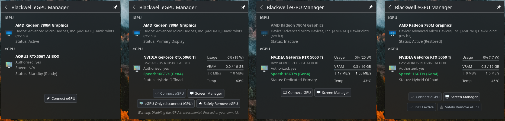
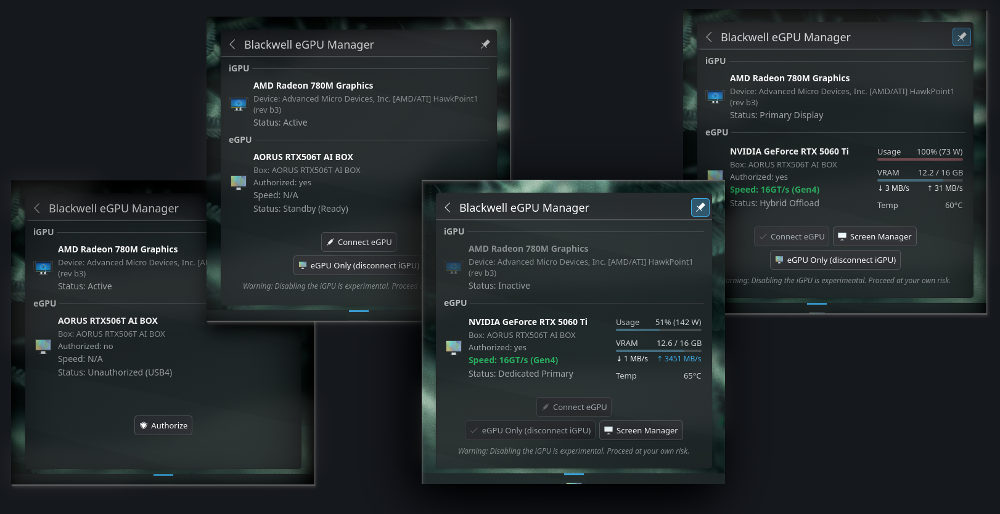
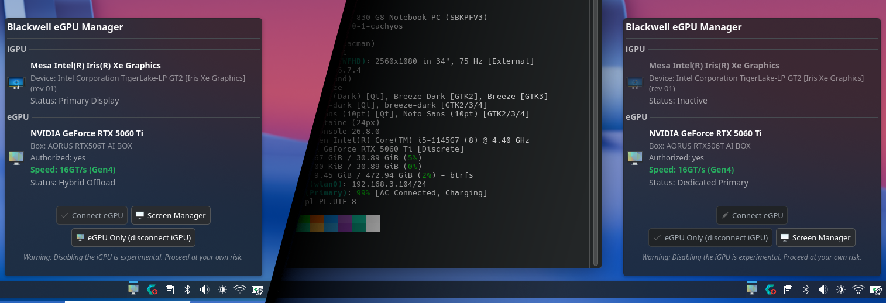
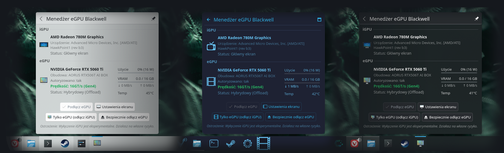
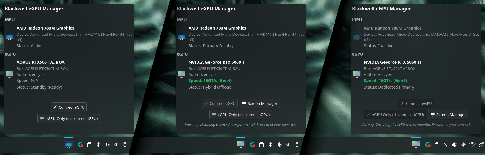
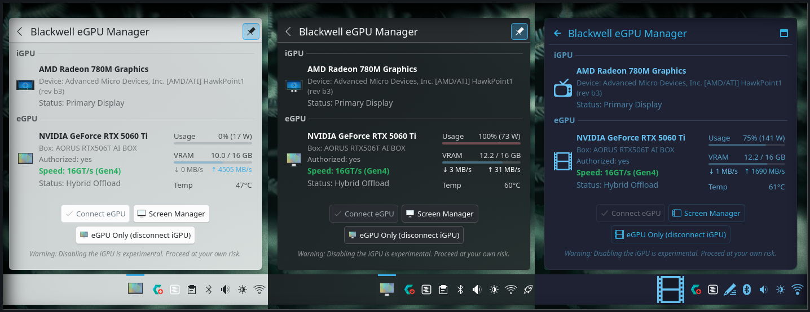

# ⚡ Blackwell eGPU Universal Manager (USB4 / TB4 / TB5)

Automated PCIe Gen4/Gen5 hardware state management, USB4 link negotiation, and display switching for **NVIDIA Blackwell (RTX 50xx)** eGPUs on Linux (KDE Plasma 6 Wayland / CachyOS / Arch Linux).



# ⚡ Before using this project, please review the following hardware and system requirements:

1. **Interface Scope (USB4 / Thunderbolt Only):**
   * Designed exclusively for eGPUs connected via **USB4, Thunderbolt 4, or Thunderbolt 5**.
   * It is **not** designed for or tested with OCuLink interfaces.

2. **Supported Host Graphics (iGPU AMD / Intel):**
   * Intended strictly for host systems featuring an **integrated GPU (AMD Radeon or Intel Iris/Arc)**.
   * Laptops with internal dedicated NVIDIA GPUs (dGPU) are **not supported** due to bus topology conflicts and module namespace overlap.

3. **Immutable Distro Compatibility (Notice):**
   * Immutable / Atomic operating systems (e.g., Bazzite, Fedora Silverblue) are **not officially supported out of the box**.
   * While the backend logic may execute correctly, system updates on immutable OSs risk overwriting or removing the required `/etc/udev/rules.d/` gating configuration.

4. **Desktop Environment & Daemon Architecture:**
   * Full functionality and automated polling are built for **KDE Plasma 6**.
   * The Plasma applet acts as the background daemon, querying the backend script every 2 seconds for real-time telemetry.
   * Headless / CLI-only usage is supported via terminal commands. (Community contributions for GNOME extensions or other DE applets are welcome).

5. **Driver Requirements (`nvidia-open`):**
   * Requires official **NVIDIA Open GPU Kernel Modules** (`nvidia-open`).
   * Compatible with driver version **580.xx and newer**.
  
# ⚡ **Ready to proceed?** If you have reviewed all 5 prerequisites above and your hardware and system environment meet these conditions, you can proceed with the Quick Start installation below.

## 🚀 Quick Start

Clone the repository and run the automated interactive installer:

```bash
git clone https://github.com/DamianKA1993/blackwell-egpu-manager.git
cd blackwell-egpu-manager
chmod +x install.sh uninstall.sh
./install.sh
```

## 💡 Important Notes (Intel Platform & First-Time Setup)

* **Intel Cold-Plug Warning**: On Intel host platforms, connecting the eGPU before powering on the system (cold-plug) may cause PCIe bridge enumeration conflicts, leading to applet initialization errors (such as NVML failing to detect the GPU in early boot). It is strongly recommended to connect/power on the eGPU after the system has fully booted into the desktop.
* **Post-Installation Reboot**: The installer deploys custom udev rules to prevent PCIe link stalls and improper driver auto-binding. A **system reboot is required** after running `install.sh` for these rules to fully take effect and ensure a clean, fixed link negotiation.



---

## 🚀 Key Features

* **Dynamic Multi-Platform Discovery**: Real-time detection of host iGPU (AMD Phoenix/HawkPoint/Strix APUs and Intel 11th Gen+ Tiger Lake / Iris Xe / Core Ultra) and NVIDIA RTX 50-series Blackwell eGPUs with zero hardcoded PCI paths.
* **Ghost-Free Hardware State Engine**: Direct synchronous querying of `/sys/bus/pci/devices/` and `boltctl` connection states, eliminating phantom devices during hot-unplug events.
* **PCIe Gen4 / Gen5 & USB4/TB Link Negotiation**: Real-time link speed detection and display (up to 16 GT/s / 32 GT/s PCIe 4.0/5.0) across Intel Barlow Ridge (TB5), Goshen Ridge (TB4), and ASMedia ASM2464PD (USB4) bridges.
* **Real-Time eGPU Telemetry (Modes 3 & 4)**: Dynamic live monitoring of GPU core usage (%), power draw (W), VRAM allocation, bidirectional PCIe bandwidth (RX/TX in MB/s), and thermals with threshold-based color highlights.
* **5-Mode Hardware State Switching Engine**:
  * **Mode 0 (Disconnected)**: USB4 / PCIe bus detached; zero power draw.
  * **Mode 1 (Unauthorized)**: Device detected via USB4/Thunderbolt, awaiting host authorization.
  * **Mode 2 (Standby / Ready)**: Controller authorized, card recognized on PCIe bus and kept in low-power standby (D3cold).
  * **Mode 3 (Hybrid Offload / PRIME)**: Active iGPU runs desktop displays while RTX 5060 Ti handles on-demand GPU offloading (`prime-run` / CUDA / Vulkan).
  * **Mode 4 (Dedicated Primary / eGPU Only)**: Dedicated GPU rendering session for external display setups with experimental runtime iGPU PCI-bus removal.
* **Multi-Language Support (i18n)**: Built-in localization support for 10 languages (`en`, `pl`, `de`, `es`, `fr`, `it`, `pt`, `uk`, `cs`, `ja`, `zh`) with automatic desktop locale detection and fallback handling.
* **KDE Display Settings Integration**: Instant one-click launcher for KDE Screen Management (`kcm_kscreen`) directly from the widget.
* **Modular Interactive Installer & Uninstaller**: Clean Bash wizards with optional udev rule management, sudoers configuration, and desktop widget deployment.
* **Native KDE Plasma 6 Applet**: Standalone Plasmoid with fixed proportions (24x24 gridUnit), live link-speed badge, and vertically centered control buttons.

---



## 🏗️ Architecture: Dynamic udev Orchestration vs. Kernel Patches & Modprobe

Running NVIDIA Blackwell (RTX 50-series) eGPUs over USB4/Thunderbolt on Linux presents unique timing and power management challenges. While alternative workflows rely on patching kernel source trees or hardcoding global driver blacklists, **blackwell-egpu-manager** uses dynamic userspace orchestration driven by `udev`.

### What the udev Rule Does

When the eGPU enclosure connects over USB4/Thunderbolt, the kernel negotiates the link and exposes PCIe bridge nodes under `/sys/bus/pci/devices/`. 

Our targeted udev rule triggers on detecting the NVIDIA device signature across the tunnel:
* **Event Interception**: Catches the device insertion event asynchronously before the driver attempts to bind to an uninitialized bus.
* **Bus Settling Window**: Introduces a deterministic delay, allowing PCIe bridges, upstream BAR allocations, and Thunderbolt tunneled domains to finish link training.
* **PCIe Register Optimization (`setpci`)**: Configures critical PCIe registers (such as ASPM Link Control and Extended Capabilities) directly in userspace to prevent link drops.
* **Coordinated Driver Attachment**: Binds the `nvidia` modules only when the physical bus topology is stable, immediately applying P0 clock locks to prevent power-state crashes.

### Why Dynamic Orchestration is Superior

* **Zero Maintenance vs. Rebuilding Kernel Modules**: Custom patches applied to `open-gpu-kernel-modules` require manual recompilation with Clang/LLVM on every kernel update. Header mismatches or DKMS failures can break the entire display stack during routine rolling-release updates. The `udev` approach runs purely in userspace using standard, distribution-provided `nvidia-open` packages.
* **Event-Driven Context vs. Destructive Modprobe Blacklists**: Setting `blacklist nvidia_drm`, `install nvidia_modeset /bin/false`, or forcing static Vulkan ICD JSON files globally cripples the NVIDIA display stack, breaking Vulkan ICD discovery and PRIME offloading. The `udev` approach acts conditionally only when the external hardware is connected, preserving complete Vulkan, OpenGL, CUDA, and PRIME functionality.
* **Preserved Host Power Management vs. Aggressive Cmdline Flags**: Global options like `pcie_port_pm=off`, `pcie_aspm.policy=performance`, or `pci=realloc=off` degrade power efficiency across all internal devices (NVMe drives, Wi-Fi, iGPU). Flags like `pcie_ports=native` can break platform ACPI `_OSC` negotiation and trigger severe MSI-X interrupt storms. The `udev` approach leaves host ACPI tables and platform power states untouched.

### Comparison Matrix

| Approach | Maintenance Burden | System Scope | Survives Kernel Updates | Preserves Full Stack (Vulkan/PRIME) |
| :--- | :--- | :--- | :--- | :--- |
| **blackwell-egpu-manager (udev)** | **None** (Stock packages) | **Targeted** (On-attach only) | **Yes** | **Yes** (PRIME & direct scanout) |
| **Kernel Source Patches** | **High** (Recompile on every kernel) | **Driver-wide** (Custom C code) | **No** (Breaks on mismatch) | **Yes** |
| **Static `modprobe.d` / Cmdline** | **Medium** (Manual overrides) | **Global** (Affects all PCIe devices) | **Yes** | **No** (Breaks display/Vulkan layers) |

---

## ⚠️ Experimental Feature Warning

> **Mode 4 (eGPU Only / Disable iGPU)** dynamically removes the integrated GPU and its associated audio controller directly from the PCI tree (`/sys/bus/pci/devices/*/remove`). This forces KDE Plasma and Wayland to render exclusively on the external GPU. While tested and functional, runtime iGPU bus removal is **highly experimental**. Use at your own risk.

---

### 💻 Tested Hardware & Community Reports

If this script resolved your eGPU crashes or lockups, please take 10 seconds to confirm your hardware setup:

[](https://github.com/DamianKA1993/blackwell-egpu-manager/issues/new?template=hardware_success.yml)

*(Click the button above to submit your CPU/Laptop model directly)*

---



## 📋 Requirements

* **OS**: CachyOS, Arch Linux, or other rolling-release distributions with Linux Kernel >= 6.10 (tested on Linux 7.2.0-cachyos).
* **Desktop**: KDE Plasma 6 (Wayland recommended; purely optional for standalone CLI usage).
* **Driver & Dependencies**:
  * NVIDIA Open Kernel Modules: `linux-cachyos-nvidia-open`, `nvidia-open-dkms`, or `nvidia-open` (610.xx+ driver series).
  * System tools: `nvidia-utils` (for NVML / `nvidia-smi`) and `bolt` (for Thunderbolt/USB4 device authorization).
* **Supported Hardware**:
  * **eGPU**: NVIDIA RTX 50-series (Blackwell architecture, e.g. AORUS RTX 5060 Ti AI BOX).
  * **USB4 / TB Bridges**: Intel Barlow Ridge (`0x5786`), Goshen Ridge / Titan Ridge (`0x15eb`, `0x0b26`), ASMedia ASM2464PD (`0x2464`).
  * **Host CPU / iGPU**:
    * AMD Ryzen APU (Phoenix, HawkPoint, Strix Point with Radeon 780M / 890M).
    * Intel Core / Core Ultra (11th Gen Tiger Lake with Iris Xe up to Meteor Lake / Arrow Lake).

---



## 🛠️ Installation

Clone the repository and run the interactive installer as a regular user:

```bash
git clone https://github.com/DamianKA1993/blackwell-egpu-manager.git
cd blackwell-egpu-manager
chmod +x install.sh uninstall.sh
./install.sh
```

The installer will interactively guide you through:
1. Verifying NVIDIA Open kernel module presence.
2. Installing the `/usr/local/bin/blackwell-egpu` backend CLI.
3. Setting up passwordless sudoers permissions for state switching.
4. *(Optional)* Deploying udev rules to prevent PCIe link stalls during hot-plug.
5. *(Optional)* Installing the KDE Plasma 6 widget with optional multi-language localization.

---

## 🔄 State Machine & Operational Modes

The manager operates as a strict, deterministic state machine spanning **Modes 0 through 6**. 

Transitions progress sequentially upwards to prevent driver race conditions, with **Mode 6** acting as the dedicated safe detach path from Hybrid mode:

```text
[0: Disconnected] ──> [1: Cable Plugged] ──> [2: Standby] ──> [3: Hybrid Offload] ──> [4: Dedicated eGPU] ──> [5: Restore iGPU]
                                                                      │
                                                                      └───> [6: Safe eGPU Detach] ───> (Back to 0 / 2)
```

### 📋 State Breakdown

* **Mode 0 (Disconnected):** No eGPU detected on the USB4/Thunderbolt bus; host runs purely on the integrated graphics (iGPU).
* **Mode 1 (Hardware Attached):** Cable plugged in and physical link established; awaiting userspace/boltctl authorization.
* **Mode 2 (Standby / Authorized):** Enclosure authorized and PCIe bridge tree traversed; ASPM/L1SS disabled, but NVIDIA kernel modules remain unloaded.
* **Mode 3 (Hybrid Offload / PRIME):** NVIDIA modules loaded, PCIe link speed negotiated (Gen4/Gen5), P0 performance clocks locked. KDE Plasma session runs on iGPU while applications can be offloaded via PRIME.
* **Mode 4 (Dedicated eGPU - Experimental):** Host iGPU is cleanly unbound and detached from the bus, routing the desktop compositor directly to the eGPU.
* **Mode 5 (Universal iGPU Restore):** Rescans the parent bridge to bring the host iGPU back online after Mode 4.
* **Mode 6 (Wayland Safe Detach):** Cleanly unbinds NVIDIA PCIe devices, syncs DRM change events, releases file locks via `fuser`, and unloads kernel modules. **Must be executed from Mode 3.**

---

### ⚠️ Transition Rules

* **Upward Escalation (0 $\rightarrow$ 1 $\rightarrow$ 2 $\rightarrow$ 3 $\rightarrow$ 4 $\rightarrow$ 5):** Modes advance sequentially. You cannot jump directly into dedicated execution without completing bridge configuration and clock stabilization.
* **The Detach Branch (0 $\rightarrow$ 1 $\rightarrow$ 2 $\rightarrow$ 3 $\rightarrow$ 6):** Safe hardware removal is strictly designed to branch off from **Mode 3**. Once the iGPU is detached in Mode 4, Wayland locks the primary rendering engine to the eGPU, preventing dynamic detachment until the system is rebooted or restored.


---

## 🖥️ CLI Usage

The backend CLI can be managed independently from scripts, keybindings, or terminals:

```bash
# Query current state (returns JSON formatted status & telemetry)
blackwell-egpu status

# Authorize USB4/TB connection (Mode 1 -> Mode 2: Standby / Ready)
sudo blackwell-egpu set 2

# Switch to Hybrid Offload (Mode 3: PRIME render offload with active iGPU)
sudo blackwell-egpu set 3

# Switch to Dedicated eGPU Mode (Mode 4: Disconnect iGPU / Primary eGPU)
sudo blackwell-egpu set 4

# Restore Integrated Graphics (Mode 5: Re-scan parent bridge & bring iGPU back online)
sudo blackwell-egpu set 5

# Wayland Safe eGPU Detach (Mode 6: Clean unbind, DRM flush & module unload from Mode 3)
sudo blackwell-egpu set 6
```

---




## 🗑️ Uninstallation

To cleanly remove all installed binaries, optional udev rules, sudoers privileges, temporary caches, and the Plasma applet:

```bash
./uninstall.sh
```

---

## 📄 License

Distributed under the MIT License. See `LICENSE` for more information.
